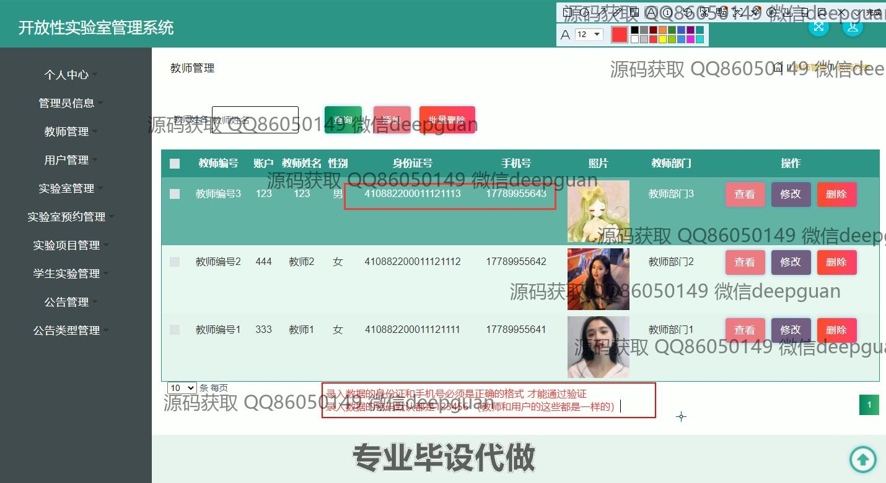
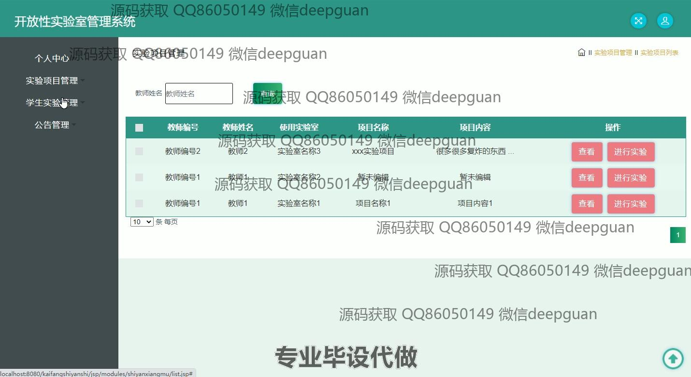
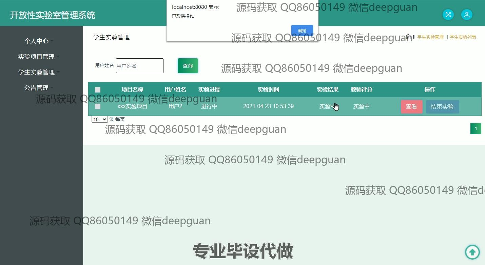

<h1 align="center">基于WEB的开放性实验室管理系统+vue</h1>

## 简介
开放性实验室管理系统：角色分为管理员和用户；提供个人中心、教师和用户管理、实验室预约与管理、实验项目管理、学生实验管理、公告管理等功能，支持高效的实验室资源管理与信息维护。    --计算机毕业设计源码；毕设源码；java毕业设计源码

## 联系方式

<h3 align="center">获取完整代码与数据库文件 + 微信：deepguan QQ: 86050149 QQ群: 783742310</h3>

<h3 align="center">可帮忙远程部署 包运行成功！提供远程部署、修改代码、设计文档指导、代码讲解等服务！</h3>

## 功能介绍（完整见运行截图）
管理员： 主要负责系统的整体管理，包括用户管理、实验室管理、实验项目管理、公告管理和设备管理等功能。管理员可以添加、修改、删除用户信息，管理实验室资源，审核实验室预约，发布和维护公告内容，管理实验项目详情，并对实验室设备进行维护与状态管理。

教师： 负责实验项目和学生实验的具体管理，能够查看和管理与自己相关的实验项目，更新实验进度和实验结果。教师可以发布新的实验项目，查看学生实验记录，评分学生实验，并通过筛选条件查询实验项目及学生相关信息。

学生： 可以进行实验室预约、查看实验项目和管理个人实验记录。学生可根据实验项目名称或用户名进行查询，查看实验进度与结果，参与实验项目并提交实验报告，完成实验后可查看教师评分和实验反馈。

普通用户： 主要包含注册和登录功能，能够查看实验室信息和公告内容。普通用户可以通过平台查询实验室资源情况和实验室预约状态，浏览实验项目和公告内容，但不能进行管理操作。

## 运行截图

本代码来源于网络,仅供学习参考使用!

